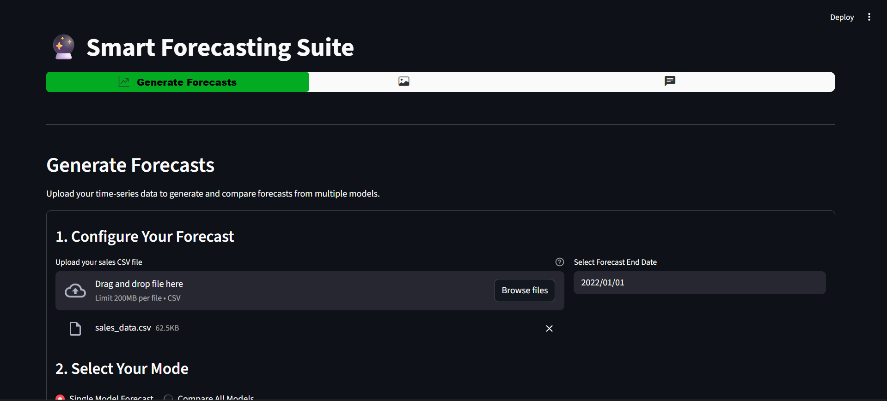
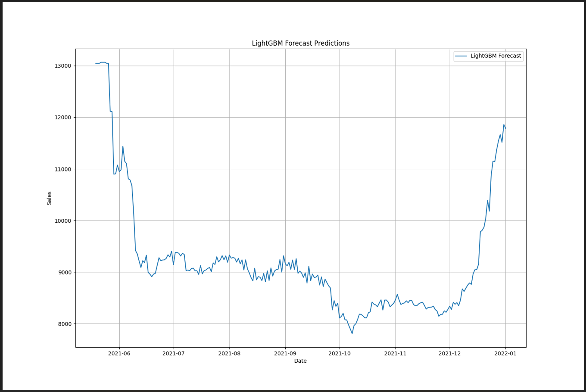
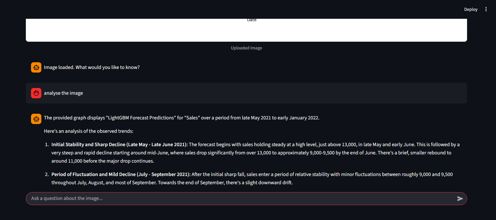
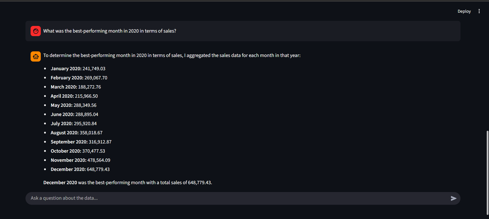

# Smart Demand 🔮

An intelligent, multi-paradigm forecasting suite that combines classical, machine learning, and deep learning models with generative AI for comprehensive time-series analysis.


---

## ✨ Features

This project is a multi-page Streamlit application designed as a complete toolkit for time-series analysis.

#### Forecasting Hub
*   **Multi-Model Forecasting:** Generate predictions using three distinct modeling paradigms:
    *   **Prophet:** A classical statistical model optimized for business forecasting.
    *   **LightGBM:** A powerful gradient-boosting model with a robust feature engineering pipeline.
    *   **LSTM:** A deep learning (Recurrent Neural Network) model for sequence prediction.
*   **Comparative Analysis Dashboard:** Run all models simultaneously and visualize their forecasts on a single, interactive chart to compare performance.
*   **Downloadable Results:** Easily download the forecast data as a CSV file or the forecast chart as a PNG image.

#### MLOps Integration
*   **Experiment Tracking with MLflow:** Every model run is automatically logged as an experiment in MLflow.
*   **Track Key Information:** Logs model parameters, training metrics (RMSE, MAE), and test metrics for rigorous evaluation and reproducibility.
*   **In-App Metrics Summary:** View a summary of the most recent experiment runs directly within the Streamlit interface.

#### Generative AI Chatbots (Powered by Google Gemini)
*   **Chat with Data:** Upload a CSV or Excel file and ask questions in natural language. The AI will analyze the data and provide insights without you writing any code.
*   **Chat with Image:** Upload an image of a graph or chart and ask for trend analysis, summaries, or specific data points.

#### Modern User Interface
*   A clean, intuitive, and responsive multi-page UI built with Streamlit.
*   Interactive widgets and clear layouts for a seamless user experience.

---

## 🧠 Understanding the Models

This application allows for a direct comparison of three different approaches to time-series forecasting.

#### 1. Prophet
*   **Paradigm:** Statistical / Additive Model
*   **Description:** Developed by Facebook, Prophet is optimized for business time series that have strong seasonal effects and holiday trends. It decomposes the time series into trend, seasonality, and holidays.

#### 2. LightGBM (Light Gradient Boosting Machine)
*   **Paradigm:** Machine Learning / Tree-Based Ensemble
*   **Description:** LightGBM is a high-performance gradient boosting framework. It cannot directly process time series, so we transform the problem into a standard regression task.
*   **Key Skill Demonstrated:** A robust feature engineering pipeline is used to create predictive features from the date, including:
    *   **Time-based features:** Day of week, month, year, week of year, etc.
    *   **Lag features:** The sales value from 7, 14, and 28 days ago.
    *   **Rolling window features:** The moving average/standard deviation over various periods.
    *   **Trend feature:** A `time_idx` is created to allow the model to learn and extrapolate trends.

#### 3. LSTM (Long Short-Term Memory)
*   **Paradigm:** Deep Learning / Recurrent Neural Network
*   **Description:** LSTMs are a special kind of RNN capable of learning long-term dependencies in sequence data, making them well-suited for time-series forecasting.


---

## 🎥 Demo
[](https://drive.google.com/file/d/1RJzCiWOP9n6PpH0c-r27hp95y9myleDi/view?usp=sharing)


## 🛠️ Installation

Follow these steps to set up and run the project locally.


#### Step 1: Clone the Repository
```bash
git clone https://github.com/your-username/your-repo-name.git
cd your-repo-name
```

#### Step 2: Create and Activate a Virtual Environment
It is highly recommended to use a virtual environment.
```bash
# For Windows
python -m venv venv
venv\Scripts\activate

# For macOS/Linux
python3 -m venv venv
source venv/bin/activate
```

#### Step 3: Install Dependencies
All required packages are listed in the `requirements.txt` file.
```bash
pip install -r requirements.txt
```

#### Step 4: Set Up Environment Variables
This project uses the Google Gemini API, which requires an API key.
1.  Create a file named `.env` in the root of the project directory.
2.  Add your API key to this file as follows:
    ```
    GOOGLE_API_KEY="YOUR_API_KEY_HERE"
    ```
3.  Obtain your API key from [Google AI Studio](https://aistudio.google.com/app/apikey).

#### Step 5: Run the Application
You need to run two services in separate terminals.

**Terminal 1: Start the MLflow UI**
This will allow you to track your model experiments.
```bash
mlflow ui
```
Navigate to `http://127.0.0.1:5000` in your browser.

**Terminal 2: Run the Streamlit App**
```bash
streamlit run multipage.py
```
The application will open in a new browser tab.

---

## 📂 File Structure

```
.
├── 📄 .env                  # Stores API keys and environment variables
├── 📄 data_bot.py           # UI and logic for the 'Chat with Data' page
├── 📄 image_bot.py          # UI and logic for the 'Chat with Image' page
├── 📄 lightgbm_script.py      # Contains the forecasting logic for the LightGBM model
├── 📄 lstm_script.py          # Contains the forecasting logic for the LSTM model
├── 📄 main.py               # UI and logic for the 'Generate Forecasts' page
├── 📄 multipage.py          # The main application router and UI frame
├── 📄 prophet_script.py       # Contains the forecasting logic for the Prophet model
├── 📄 README.md             # This file
└── 📄 requirements.txt      # Lists all Python dependencies for the project
```

---

## 📸 Screenshots
<h2 align="center">🖥️ User Interface</h2>
<p align="center">
  
</p>

<h2 align="center">📊 Chart Image</h2>
<p align="center">
  
</p>

<h2 align="center">💬 Chat with Image</h2>
<p align="center">
  
</p>

<h2 align="center">📈 Chat with Data</h2>
<p align="center">
  
</p>


